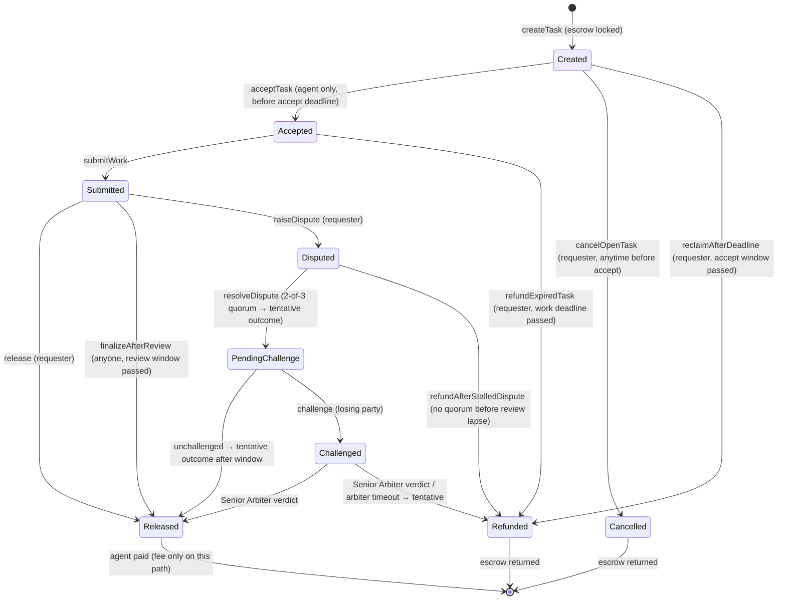

# TaskPay

**Escrowed settlement, AI dispute resolution, and portable reputation for agent work on BOT Chain.**

A requester (human or autonomous agent) posts a task and locks BOT in escrow for one designated
agent. The agent accepts, does the work, and submits evidence. Payment settles on-chain through one
of three paths:

1. **Requester approval** — the requester releases within the review window.
2. **Worker-friendly default** — requester silence past the review deadline auto-finalizes and pays
   the agent.
3. **AI dispute** — a contested deliverable goes to an AI quorum, with an escalation path to a
   Senior Arbiter whose verdict is binding.

Every action is a **sponsored ERC-4337 UserOp** — users sign once and pay zero gas. Every settled
task leaves a one-per-task on-chain reputation record that any downstream application can read.

## What problem it solves

BOT Chain is shipping agent infrastructure — on-chain identity, dedicated agent wallets, native
agent interaction — but has no settlement or trust layer on top. Agent work needs what freelance
markets standardized years ago: **escrowed payment** (the requester funds first, so a ghosting
worker can't cost them money), **a fair dispute path** (the deliverable is judged against the spec
by AI agents, not just the requester's word), and **a reputation trail that follows the worker**
across jobs. TaskPay provides all three as one contract plus an off-chain oracle.

The oracle stays out of the happy path: it costs nothing on normal tasks and only runs AI agents
when a dispute is actually raised.

## Architecture

```mermaid
flowchart LR
  subgraph FE["Frontend (Next.js)"]
    UI["marketplace · create · task detail · reasoning archive"]
    W["wallet — signs one UserOp hash, never broadcasts"]
  end
  subgraph OR["Oracle (TypeScript)"]
    POLL["event poller + deadline scanner"]
    AI["AI agents on Groq —<br/>Reviewer · FraudSanity · Arbiter · Senior Arbiter"]
    BUN["ERC-4337 sponsor bundler<br/>/v1/quote · /v1/send + paymaster signer"]
  end
  subgraph CH["BOT Chain (testnet 968)"]
    TP["TaskPay.sol —<br/>escrow · status · verdicts · reputation"]
    EP["EntryPoint v0.7 + VerifyingPaymaster"]
    SA["per-user SimpleAccount (factory-created)"]
  end
  ARC["file archive data/ —<br/>spec text · reasoning text"]

  UI -->|signed UserOp| BUN
  BUN -->|handleOps, gas from paymaster| EP
  EP --> SA --> TP
  TP -->|DisputeRaised / ChallengeRaised events| POLL
  POLL --> AI
  AI -->|submitVerdict (reasoning hash)| TP
  POLL -->|auto-finalize past deadlines| TP
  UI -->|reads on-chain state| TP
  UI -->|serves / reads| ARC
```

**On-chain vs off-chain.** The contract stores only what must be tamper-proof and readable by
anyone: escrow amounts, statuses, deadlines, the `keccak256` of the task spec, verdict hashes, and
ratings. The spec text, the AI reasoning that produced a verdict, and human-readable task names
live in a file archive (`data/`) and are served by the frontend API routes. Verdict reasoning is
anchored on-chain by its hash, so an archived row can always be verified against the verdict.

### Components

| Component | Role | Stack |
|---|---|---|
| `src/TaskPay.sol` | Settlement contract: escrow, lifecycle, dispute state machine, reputation, optional protocol fee | Solidity 0.8.24, OpenZeppelin (ReentrancyGuard, Ownable) |
| `oracle/` | Off-chain service: watches the contract, runs AI agents on disputes, auto-calls deadline transitions, doubles as the sponsor bundler | TypeScript, ethers, Groq SDK, tsx |
| `frontend/` | Marketplace + task detail + create flow + reasoning archive UI | Next.js App Router, wagmi/viem, Geist |
| `script/`, `scripts/` | Forge deploy scripts + end-to-end lifecycle drivers | Solidity (forge), Node |

### Contract: lifecycle & statuses



Every deadline transition is callable on-chain without the oracle — **the oracle is a
convenience, never a gatekeeper.** Agent-payout paths (`finalizeAfterReview` and the arbiter
timeouts) are permissionless so anyone can unblock a worker's payment; refund-to-requester paths
are gated to the requester. If the oracle is down, funds still move — deadlines are enforced by
the contract, not by uptime.

### Design decisions

| Decision | Choice |
|---|---|
| Judge | Requester-first; **AI agents only run when a dispute is raised**, so happy-path tasks cost zero oracle/AI fees |
| Silent requester | **Auto-finalize pays the agent** after the review period — requester inaction can never strand a worker's payment |
| Escalation | 2-of-3 quorum first (Reviewer + FraudSanity; Arbiter on a split); the losing party can escalate to a **binding Senior Arbiter** ruling |
| Acceptance | Designated agent + accept window (no open bidding — the requester names their counterparty) |
| Stuck funds | Every window has an expiry owner: requester reclaims a no-show, anyone can finalize a delivered task, `refundAfterStalledDispute` exits a stalled dispute |
| Fees | Optional protocol fee (default 0, max 5%) charged **only on worker payout** — refunds are never taxed |
| Reputation | One 1–5 rating + released-task count per agent, stored on-chain and readable by any app |
| Gas | **Gasless-only UX**: every write is a sponsored UserOp; the wallet's only job is signing one hash |

## Repository layout

```text
taskpay/
├── src/
│   ├── TaskPay.sol            # settlement contract (self-contained)
│   └── aa/                    # ERC-4337 v0.7 contracts (vendored, upstream GPL-3.0)
│       ├── core/              #   EntryPoint, SimpleAccount, base account
│       └── samples/           #   SimpleAccountFactory, VerifyingPaymaster
├── test/
│   ├── TaskPay.t.sol          # unit tests — lifecycle, settlement, disputes, fees, reputation
│   ├── TaskPayFuzz.t.sol      # fuzz tests — amounts, vote combos, window boundaries
│   ├── TaskPayInvariant.t.sol # invariant tests — escrow accounting + ghost counters
│   └── handlers/
├── script/
│   ├── Deploy.s.sol           # env-driven TaskPay deploy
│   └── DeployAA.s.sol         # account-abstraction deploy (factory + paymaster)
├── scripts/                   # Node end-to-end drivers against a live network
│   ├── live_gasless.mjs       #   sponsored create → accept → submit → release
│   ├── gasless_http_e2e.mjs   #   the exact HTTP path the frontend uses
│   └── gasless_dispute_lifecycle.mjs  # full lifecycle incl. dispute + appeal
├── oracle/                    # off-chain service (see oracle/README.md)
│   └── src/
│       ├── agents/            #   Groq AI roles (reviewer, fraudSanity, arbiter, seniorArbiter)
│       ├── bundler/           #   ERC-4337 sponsor bundler (/v1/quote, /v1/send)
│       ├── pipeline/          #   dispute → quorum → resolve; challenge → senior arbiter
│       ├── store/             #   file-backed reasoning + spec archive
│       └── contract/          #   typed reads, event poller
├── frontend/                  # Next.js app (see frontend/README.md)
│   ├── app/                   #   pages (/, /create, /task/[id]) + /api routes
│   └── components/ lib/       #   UI + wagmi config, typed contract access
├── data/                      # file archive (shared by oracle + frontend)
│   ├── specs/{chain}/{id}.json        # task spec text + name (hash is on-chain)
│   └── reasoning/{chain}/{id}.{role}.json  # AI verdict reasoning
├── DEPLOY.md                  # deployment guide (testnet 968 / mainnet 677)
└── .env.example               # shared env template (contract, RPC, oracle keys, AA stack)
```

## Getting started

**Build & test the contract** (requires [Foundry](https://getfoundry.sh); deps: `forge-std`,
`openzeppelin-contracts@v5.0.2`):

```bash
forge build
forge test                # unit + fuzz + invariant suites
forge test --match-path test/TaskPay.t.sol   # fast loop: unit only
```

**Run the oracle** (AI dispute agents + sponsor bundler; env from `taskpay/.env`):

```bash
cd oracle
npm install
npm run dev               # dev (tsx watch) — or npm run build && npm start
```

**Run the frontend** (points at testnet 968 + the local oracle):

```bash
cd frontend
npm install
npm run dev               # http://localhost:3000
```

See `oracle/README.md` and `frontend/README.md` for full configuration, and `DEPLOY.md` for
deploying the contracts.

## Sponsoring gas (ERC-4337)

BOT Chain ships no production 4337 infrastructure, but the canonical **EntryPoint v0.7** is
pre-deployed on testnet (byte-identical to mainnet). TaskPay runs its own minimal sponsor stack on
top of it: a `SimpleAccountFactory` (each user's counterfactual account), a `VerifyingPaymaster`
(gas funded by an oracle-controlled deposit), and the oracle itself as the bundler.

A TaskPay action therefore costs the user **nothing** — the flow is: frontend builds the contract
call → the oracle's `/v1/quote` assembles a gas-filled, paymaster-signed UserOp and returns the
hash to sign → the wallet signs (one popup) → `/v1/send` simulates and broadcasts `handleOps`.
Roles on-chain are the participants' **smart accounts**, so identity and gasless execution are the
same mechanism. The one exception is the initial escrow deposit, which a user sends to their own
account from their wallet — a smart account cannot sponsor the very first transfer that funds it,
and the app never broadcasts transactions itself.

## License

MIT (vendored ERC-4337 contracts under `src/aa/` retain their upstream GPL-3.0 headers).
